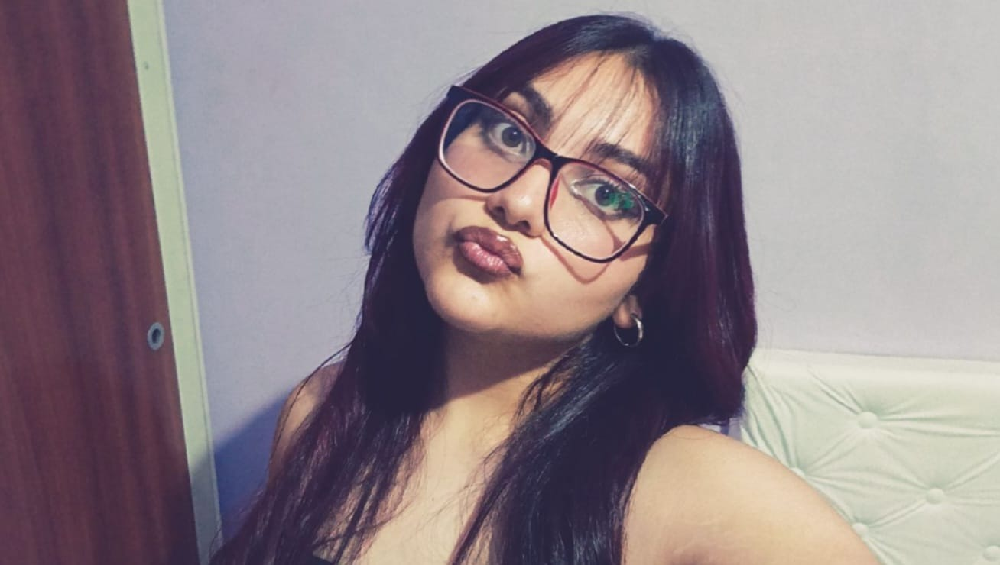

# Programación con objetos I
### Gianna Jazmin Davalos

 Hola, me llamo **Gianna** y este es mi septimo cuatrimestre de la carrera **Programación y Desarrollo de Videojuegos**, estoy todavia con materias del segundo año.

 En **2025** hice un curso de **Diseño Grafico I y Diseño Grafico II** y **Habilidades Digitales**, estos cursos los hice mientras cursaba Programacion Estructurada que me costo un año entero poder aprobarla y recien en el curso de verano la promocione.

 Me incribi a la carrera a fines del **2022** con mi amiga **Luciana** mientras terminabamos el secundario. Con mi amiga cursamos casi las mismas materias pero diferente carrera, asi que nos seguimos viendo.

 En el **2025** hice cursos que me ayudo a adquirir nuevos conocimientos para diseñar, crear y poder trabajar con programas como **Photoshop**, **CorelDraw** y **Microsoft office avanzado**, etc.
 Siempre me gusto la informatica y el diseñar (Dibujar), pero nunca habia estudiado tan a profundidas, hasta que indague, me informe y estuide que me apasiono  y me gusto mucho poder tener conocimientos.

!

 Vivo en **Rafael Castillo**, en el partido de **La Matanza**.

### Mis gustos
- Lo que me es hacer **Handball**, es un deporte que hago desde hace 10 años y lo hare hasta que mi cuerpo no pueda más .

- Me gustan muchos los perros, tengo una caniche llamada **Kim** que es mi vida entera.

- Siempre me gusto las cosas de terror, como las peliculas, las cosas paranormales y uno de mis sueños siempre fue estudiar **Medica Forence** o **Criminologia**.

- Me encanta todo lo que tenga que ver con el universo, los extraterrestre, el Area 51, lo iluminati, el triangulo de las bermudas, etc.

- Soy fanatica de marvel.

- Mi objetivo en la vida es poder tener un titulo universitario, poder mudarme y tener un cuarto con todas las cosas de marvel. 
